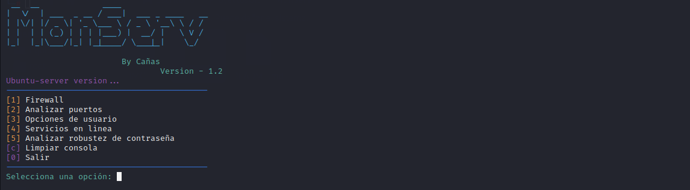
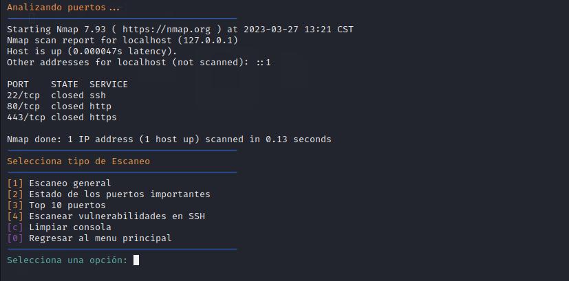
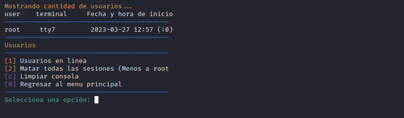
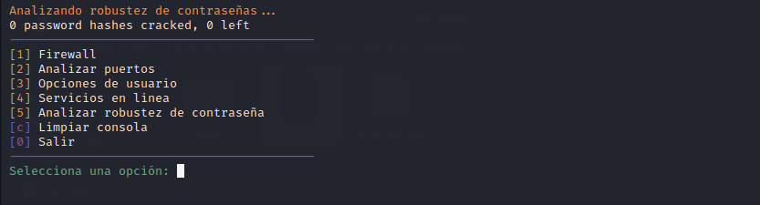

# MonServ
MonServ is a cybersecurity tool that allows you to verify the security of your Ubuntu server through various options, such as measuring password strength, checking open ports, analyzing running services, and monitoring active connections. With these functions, you can ensure that your server is well-protected and further strengthen its security.

# Port analysis / Analizar puertos
This option includes the use of another tool called "Nmap", which aims to detect if there are any open ports that could compromise the security of the system. By using this tool, the detection process is automated, and the most important data is displayed clearly and concisely. This allows the user to have a more detailed view of the security status of their system and take preventive measures to ensure its protection.

# User options / Opciones de usuario
In this section, it is possible to remotely monitor the users who are active on the server, allowing to keep track of their actions. Additionally, it is possible to remove those users who are not in use, leaving only the active root user for emergency situations or when suspicious movements are detected. This ensures the security and efficiency of the server by having complete control over the users who access the system.

# Analyze password strength / Analizar robustez de contraseña
This option uses a cracking tool called "John" which uses its own list or bank of passwords to verify if it is not a common password. This way, the security of the system is increased by preventing the use of easy-to-guess passwords and forcing users to use stronger and more robust passwords.

# Updates/Actualizaciones

Version 1.2 comes with a series of improvements and new features to make the user experience even better. Firstly, the user interface has been redesigned to make it easier to read and use for common technology users. The new interface has a more readable design, which will facilitate the reading and visualization of results.

The user removal function has been modified to include disconnecting remote terminals. This ensures the complete removal of unknown users from the server, improving its security by 100%. With this update, inactive or unauthorized users will be automatically disconnected, preventing any unauthorized access to the server and ensuring the integrity of its data and resources.

The firewall section is already operational, however, it currently has limited and basic options.

