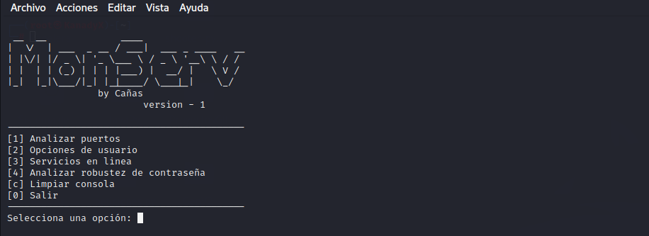
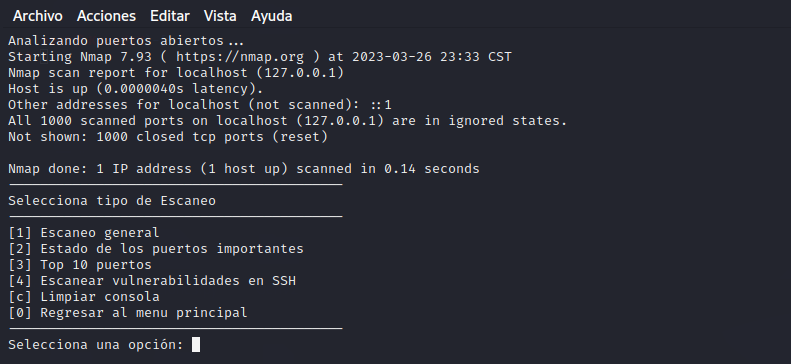
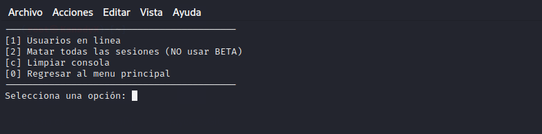
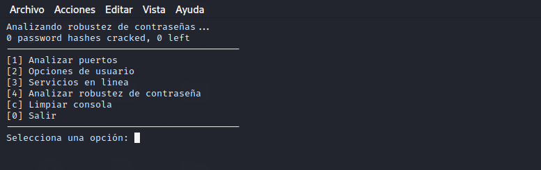

# MonServ

MonServ is a cybersecurity tool that helps you verify the security of your server, specifically Ubuntu-server, with options such as measuring the level of strength in your passwords, checking ports, analyzing services, and observing who is connected.

# Port analysis / Analizar puertos
This option uses another tool called "Nmap" with the intention of verifying if there is any open port that should not be, with this tool the process is automated and some of the most important data is shown.

# User options / Opciones de usuario
In this section, you can monitor who is active within the server (remotely) and thus keep track of users. You can also scan for users, leaving the server with only the active root user for emergencies or suspicious movements.

# Analyze password strength / Analizar robustez de contraseña
This option uses a cracking tool called "John" which uses its own list/bank of passwords to verify that it is not a common password.

